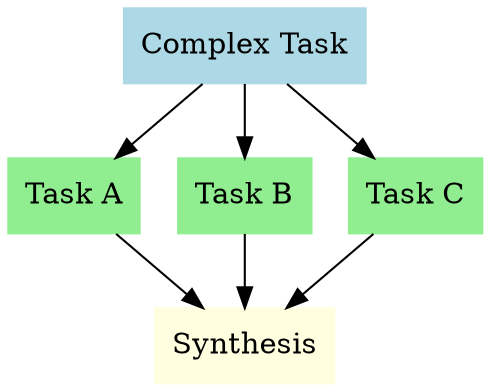

# Agent Task Coordinator

## Overview

This skill provides guidance for coordinating multiple AI agents, managing agent teams, and delegating work across specialized agents. It covers communication patterns, task decomposition, and team coordination strategies. Based on agent collaboration patterns and distributed systems best practices.

## When to Use

**Use this skill when:**

- Coordinating multiple agents for complex tasks
- Managing agent teams with different specializations
- Delegating work across specialized agents
- Designing agent communication patterns
- Breaking down complex tasks for parallel execution
- Managing agent team lifecycle
- Implementing agent team composition strategies
- Setting up task decomposition workflows
- Creating agent communication protocols
- Building agent swarm patterns
- Implementing agent handoff mechanisms
- Setting up MCP reporting for agent teams
- Managing agent task state machines
- Implementing agent team health monitoring
- Creating agent team shutdown procedures
- Building agent team documentation
- Setting up agent team metrics and KPIs
- Implementing agent team error handling
- Creating agent team retry strategies
- Building agent team monitoring dashboards
- Setting up agent team alerting
- Implementing agent team resource management
- Creating agent team scaling strategies

**Do NOT use this skill when:**

- Single-agent tasks (use specific skill for the task)
- Simple, linear workflows (use standard workflow patterns)
- Non-agentic workflows (use standard application development)
- Basic task automation without agent coordination

## Core Patterns

### Agent Team Composition

```
┌─────────────────────────────────────────────────────────────┐
│              Team Lead (Orchestrator)                       │
│  └── Task decomposition, coordination, synthesis            │
├─────────────────────────────────────────────────────────────┤
│  ┌─────────────┐  ┌─────────────┐  ┌─────────────┐         │
│  │  Implementer│  │   Reviewer  │  │   Debugger  │         │
│  │   (Parallel)│  │   (Parallel)│  │   (Parallel)│         │
│  └─────────────┘  └─────────────┘  └─────────────┘         │
│         │              │              │                      │
│         └──────────────┴──────────────┘                      │
│                    │                                         │
│         ┌──────────▼──────────┐                              │
│         │   Integration Point │                              │
│         └─────────────────────┘                              │
└─────────────────────────────────────────────────────────────┘
```

### Task Decomposition Pattern



### Agent Communication Protocol

```
┌─────────────┐                    ┌─────────────┐
│   Sender    │                    │   Receiver  │
│   Agent     │                    │   Agent     │
└──────┬──────┘                    └──────┬──────┘
       │                                  │
       │  1. Request/Task                 │
       │─────────────────────────────────>│
       │                                  │
       │  2. Acknowledgment               │
       │<─────────────────────────────────│
       │                                  │
       │  3. Progress Updates (optional)  │
       │<─────────────────────────────────│
       │                                  │
       │  4. Final Result                 │
       │<─────────────────────────────────│
       │                                  │
       │  5. Confirmation                 │
       │─────────────────────────────────>│
       │                                  │
```

## Task Delegation

### When to Delegate

- **Parallel Execution**: Tasks with no dependencies
- **Specialization**: Tasks matching agent strengths
- **Complexity**: Tasks requiring specific expertise
- **Scale**: Tasks too large for single agent

### When NOT to Delegate

- Simple, linear workflows
- Tasks requiring tight coupling
- When context switching overhead is high
- Small tasks (< 5 minutes estimated)

### Delegation Template

```
Task: [Task description]
Agent Type: [Specialized agent type]
Context: [Relevant background information]
Constraints: [Any limitations or requirements]
Success Criteria: [How to measure success]
Deadline: [If applicable]
```

## Agent Team Lifecycle

### 1. Formation

- Identify task requirements
- Select appropriate agent types
- Define communication protocols
- Set success criteria

### 2. Execution

- Distribute tasks
- Monitor progress
- Handle dependencies
- Manage blockers

### 3. Synthesis

- Collect results
- Combine outputs
- Resolve conflicts
- Validate outcomes

### 4. Shutdown

- Clean up resources
- Document results
- Archive conversations
- Prepare for next task

## Communication Patterns

### Broadcast Pattern

```
Leader
  ├── Agent 1
  ├── Agent 2
  └── Agent 3
```

Use for: Announcements, status updates

### Request-Response Pattern

```
Requester ──> Agent ──> Response
```

Use for: Task delegation, information gathering

### Publish-Subscribe Pattern

```
Publisher ──> Topic ──> Subscriber 1
                   └─> Subscriber 2
                   └─> Subscriber 3
```

Use for: Event notifications, status updates

## Common Mistakes

### ❌ Bad: Over-delegation

```
Complex Task
├── Subtask 1 (delegated)
├── Subtask 2 (delegated)
├── Subtask 3 (delegated)
├── Subtask 4 (delegated)
├── Subtask 5 (delegated)
└── ... (10+ subtasks)
```

Problems:

- Coordination overhead
- Context switching
- Integration complexity

### ✅ Good: Strategic delegation

```
Complex Task
├── Subtask 1 (delegated to specialist)
├── Subtask 2 (delegated to specialist)
└── Remaining work (handled by orchestrator)
```

Benefits:

- Focus on strengths
- Manageable complexity
- Clear integration points

### ❌ Bad: No communication protocol

```
Agent 1 ──> ? ──> Agent 2 ──> ? ──> Agent 3
```

Problems:

- Unclear expectations
- No progress tracking
- Integration issues

### ✅ Good: Clear protocol

```
Agent 1 ──[request]──> Agent 2 ──[response]──> Agent 3
         ──[progress]──>                    ──[result]──>
```

Benefits:

- Clear expectations
- Progress tracking
- Smooth integration

## MCP Reporting Protocol

**Every agent MUST use MCP reporting tools for task progress. No silent work.**

### Task State Machine

| State         | Meaning         | Who Sets It       | When                   |
| ------------- | --------------- | ----------------- | ---------------------- |
| `pending`     | Not started     | Planner           | Initial plan creation  |
| `in_progress` | Working         | Agent             | report_progress call   |
| `blocked`     | Stuck           | Agent             | report_blockage call   |
| `completed`   | Done + verified | Agent + Commander | report_completion call |
| `failed`      | Cannot complete | Agent             | Terminal state         |

### MCP Reporting Tools

| Tool                 | When to Use            | Required Fields                       |
| -------------------- | ---------------------- | ------------------------------------- |
| `report_progress`    | Starting + milestones  | taskId, agent, summary                |
| `report_completion`  | Task done + verified   | taskId, agent, summary, files_changed |
| `report_blockage`    | Stuck or blocked       | taskId, agent, reason                 |
| `log_event`          | Major decisions        | agent, event_type, description        |
| `check_dependencies` | Before parallel launch | tasks array with id + dependsOn       |
| `get_task_state`     | Check task status      | taskId (optional — returns all)       |

### Workflow

```
report_progress (start) ──→ in_progress
                              │
                              ├─→ report_progress (milestone)
                              │
                              ├─→ report_blockage (stuck)
                              │       └─→ unblock → report_progress
                              │
                              └─→ report_completion (done + verified)
```

## Real-World Impact

**Before this skill:**

- Agents working in isolation
- Duplicate effort
- Integration issues
- No coordination strategy

**After this skill:**

- Coordinated agent teams
- Efficient parallel execution
- Clear communication
- Successful complex tasks

## Cross-References

- **`team-lead`** - For team leadership patterns
- **`parallel-execution`** - For parallel task execution
- **`task-coordination-strategies`** - For detailed coordination patterns

## References

- [Team Topologies](https://teamtopologies.com/) - Matthew Skelton
- [Agent Collaboration Patterns](https://example.com/agent-patterns)
- [Distributed Systems Patterns](https://martinfowler.com/articles/distributed-systems-patterns.html)
