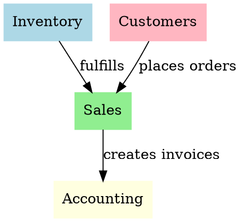

# ERP/SaaS Project Organization

## Overview

This skill provides a comprehensive framework for organizing large-scale ERP, SaaS, and enterprise applications. It establishes rules, workflows, module boundaries, and maintainability standards to ensure teams can scale effectively while maintaining code quality.

**Core Principles:**

- Single Responsibility per Module
- Clear Boundaries and Contracts
- Convention over Configuration
- Documentation as Code
- Test-First Organization

Based on enterprise software architecture certifications and industry best practices.

## When to Use

**Use this skill when:**

- Setting up a new ERP, SaaS, or enterprise project
- Refactoring a legacy codebase with organizational issues
- Scaling the team and need clear boundaries
- Adding new developers and need onboarding structure
- Planning architecture decisions
- Designing monorepo vs multi-repo strategies
- Setting up bounded contexts for domain-driven design
- Creating module separation by business domain
- Implementing layered architecture patterns
- Establishing feature-sliced design structures
- Defining module contracts and interfaces
- Setting up naming conventions across the project
- Creating module documentation standards
- Implementing CI/CD pipelines for large projects
- Setting up code review processes for enterprise teams
- Creating project onboarding guides
- Establishing quality gates and testing standards
- Implementing security and compliance requirements
- Setting up monitoring and observability standards
- Creating deployment strategies for enterprise applications

**Do NOT use this skill when:**

- Working on small projects (< 50k lines)
- One-off scripts or prototypes
- Projects with established patterns you're happy with
- Urgent bug fixes (defer organizational work)
- Simple CRUD applications without business complexity

## Project Structure Organization

### Monorepo vs Multi-repo

```
Decision Flow:
┌─────────────────────┐
│ Project Size &      │
│ Complexity?         │
└─────────┬───────────┘
          │
          ├─ Small (<50k lines) ──> Single Repository
          │
          └─ Large (Enterprise) ──> Monorepo with Bounded Contexts
                                     or Multi-repo with Shared Libraries
```

### Folder Structure Pattern

```
project/
├── apps/                    # Applications (web, mobile, api)
│   ├── web/                 # Web frontend
│   ├── mobile/              # Mobile app
│   └── api/                 # API gateway
├── packages/                # Shared packages
│   ├── ui/                  # UI components
│   ├── utils/               # Utility functions
│   └── types/               # TypeScript definitions
├── modules/                 # Business modules (ERP-specific)
│   ├── inventory/           # Inventory management
│   ├── sales/               # Sales module
│   └── accounting/          # Accounting
├── shared/                  # Cross-cutting concerns
│   ├── auth/                # Authentication
│   ├── logging/             # Logging infrastructure
│   └── config/              # Configuration
└── scripts/                 # Automation scripts
```

### Module Separation by Bounded Context

Each module should represent a business domain:



**Module Contract Requirements:**

- Clear input/output interfaces
- Versioned APIs
- Dependency documentation
- Breaking change policy

## Core Patterns

### Layered Architecture

```
┌─────────────────────────────────────┐
│     Presentation Layer              │  Controllers, Views, DTOs
├─────────────────────────────────────┤
│     Application Layer               │  Use cases, Services
├─────────────────────────────────────┤
│     Domain Layer                    │  Entities, Value Objects
├─────────────────────────────────────┤
│     Infrastructure Layer            │  DB, APIs, External Services
└─────────────────────────────────────┘
    Dependencies point INWARD
```

### Feature-Sliced Design

```
features/
├── inventory/
│   ├── ui/              # UI components
│   ├── lib/             # Business logic
│   ├── api/             # API calls
│   └── config/          # Feature configuration
├── sales/
│   └── ...
shared/
└── core/                # Cross-cutting concerns
```

## Quick Reference

### Naming Conventions

| Item       | Convention       | Example                 |
| ---------- | ---------------- | ----------------------- |
| Files      | PascalCase       | `InventoryManager.ts`   |
| Folders    | kebab-case       | `inventory-management/` |
| Variables  | camelCase        | `inventoryItems`        |
| Constants  | UPPER_SNAKE_CASE | `MAX_INVENTORY_LEVEL`   |
| Interfaces | Prefix I         | `IInventoryItem`        |
| Types      | PascalCase       | `InventoryItemId`       |

### Module Boundaries

```typescript
// ❌ BAD: Circular dependency
// module-a depends on module-b
// module-b depends on module-a

// ✅ GOOD: Clear dependency direction
// module-a (core domain)
//    ↓
// module-b (application)
//    ↓
// module-c (interface)
```

### Documentation Requirements

**Every module must have:**

- `README.md` with purpose and usage
- `API.md` documenting interfaces
- `DECISIONS.md` recording architecture decisions
- `TESTING.md` explaining test strategy

## Implementation

### Module Template

See `assets/templates/module-template/` for a complete module scaffold including:

- Module metadata (`module.json`)
- README template
- Entry point skeleton
- Test structure

### Automation Scripts

See `scripts/` for tools to:

- `project-setup.bat` - Initialize new project structure
- `analyze-structure.ps1` - Analyze existing codebase
- `module-validator.ps1` - Validate module boundaries
- `documentation-check.ps1` - Check documentation coverage

## Common Mistakes

### ❌ Bad Module Boundaries

```typescript
// Mixing concerns
class InventoryController {
  // Business logic
  calculateReorderPoint() {}

  // API logic
  handleRequest() {}

  // Database logic
  saveToDb() {}
}
```

### ✅ Good Module Boundaries

```typescript
// Separate by responsibility
class InventoryController {
  constructor(private service: InventoryService) {}

  handleRequest() {
    return this.service.processRequest();
  }
}

class InventoryService {
  constructor(private repository: InventoryRepository) {}

  processRequest() {
    return this.repository.save(...);
  }
}
```

### ❌ Bad Naming

```typescript
// Unclear, vague
class DataHandler {
  void process() { }
}

// Long, unscoped
class InventoryManagementSystemController {
  void handleRequest() { }
}
```

### ✅ Good Naming

```typescript
// Clear, specific
class InventoryReorderController {
  void requestReorder() { }
}

// Scoped properly
class InventoryController {
  void handleRequest() { }
}
```

## Real-World Impact

**Before this skill:**

- 40% of time spent finding code
- Mixed concerns throughout codebase
- Difficulty onboarding new developers
- Unclear module responsibilities

**After this skill:**

- 15% of time spent finding code
- Clear separation of concerns
- New developers productive in 1 week
- Explicit module boundaries and contracts

## API Development (Python/FastAPI)

When building APIs with Python and FastAPI, follow these best practices:

### Project Structure

```
app/
├── main.py                 # FastAPI app entry point
├── config/                 # Configuration management
│   ├── base.py
│   ├── development.py
│   └── production.py
├── api/                    # API routes
│   ├── v1/
│   │   ├── __init__.py
│   │   ├── routes/
│   │   │   ├── items.py
│   │   │   └── users.py
│   │   └── deps.py         # Dependencies (get_db, get_current_user)
│   └── dependencies.py
├── core/                   # Core functionality
│   ├── security.py         # Authentication, hashing
│   ├── database.py         # Database session management
│   └── config.py
├── models/                 # Database models
│   ├── base.py
│   ├── user.py
│   └── item.py
├── schemas/                # Pydantic schemas
│   ├── __init__.py
│   ├── user.py
│   └── item.py
├── crud/                   # CRUD operations
│   ├── __init__.py
│   ├── user.py
│   └── item.py
└── tests/                  # Test suite
```

### FastAPI Best Practices

```python
# main.py
from fastapi import FastAPI
from fastapi.middleware.cors import CORSMiddleware
from fastapi.middleware.trustedhost import TrustedHostMiddleware

app = FastAPI(
    title="ERP API",
    description="Enterprise Resource Planning API",
    version="1.0.0",
    docs_url="/docs",
    redoc_url="/redoc",
)

# CORS middleware
app.add_middleware(
    CORSMiddleware,
    allow_origins=["https://example.com"],
    allow_credentials=True,
    allow_methods=["*"],
    allow_headers=["*"],
)

# Trusted host middleware (production)
app.add_middleware(TrustedHostMiddleware, allowed_hosts=["example.com", "*.example.com"])

# Include routers
from api.v1.routes import items, users
app.include_router(items.router, prefix="/api/v1/items", tags=["items"])
app.include_router(users.router, prefix="/api/v1/users", tags=["users"])
```

### Pagination Implementation

```python
# Use fastapi-pagination for cursor-based pagination
from fastapi import FastAPI, Depends
from fastapi_pagination import Page, add_pagination
from fastapi_pagination.cursor import CursorPage, CursorParams

app = FastAPI()
add_pagination(app)

# Cursor-based pagination (recommended for large datasets)
@app.get("/items", response_model=CursorPage[Item])
async def get_items(
    params: CursorParams = Depends(),
    db: Session = Depends(get_db),
):
    from fastapi_pagination.ext.sqlalchemy import paginate
    return paginate(db, select(Item).order_by(Item.id))

# Page-based pagination (simple cases)
@app.get("/items/page", response_model=Page[Item])
async def get_items_page(
    page: int = 1,
    size: int = 20,
    db: Session = Depends(get_db),
):
    from fastapi_pagination import paginate
    return paginate(db, select(Item).order_by(Item.id), page=page, size=size)
```

### Security Best Practices

```python
from fastapi import FastAPI, Depends, HTTPException, status
from fastapi.security import OAuth2PasswordBearer, SecurityScopes
from jose import JWTError, jwt
from passlib.context import CryptContext

# Password hashing
pwd_context = CryptContext(schemes=["bcrypt"], deprecated="auto")

# OAuth2 scheme
oauth2_scheme = OAuth2PasswordBearer(
    tokenUrl="/api/v1/auth/token",
    scopes={
        "read": "Read access",
        "write": "Write access",
        "admin": "Admin access",
    },
)

# Dependency chain for authentication
async def get_current_user(
    token: str = Depends(oauth2_scheme),
):
    credentials_exception = HTTPException(
        status_code=status.HTTP_401_UNAUTHORIZED,
        detail="Could not validate credentials",
        headers={"WWW-Authenticate": "Bearer"},
    )
    try:
        payload = jwt.decode(token, SECRET_KEY, algorithms=[ALGORITHM])
        username: str = payload.get("sub")
        if username is None:
            raise credentials_exception
    except JWTError:
        raise credentials_exception
    return username

async def get_current_active_user(
    current_user: str = Depends(get_current_user),
):
    if current_user.disabled:
        raise HTTPException(status_code=400, detail="Inactive user")
    return current_user

# Endpoint with authentication
@app.get("/users/me", response_model=User)
async def read_users_me(
    current_user: str = Depends(get_current_active_user),
):
    return current_user
```

### Response Models

```python
from pydantic import BaseModel
from typing import Optional, List

# Base schema
class ItemBase(BaseModel):
    name: str
    price: float
    description: Optional[str] = None

# Response schema (filters private data)
class ItemResponse(ItemBase):
    id: int
    created_at: str

# Collection response with pagination metadata
class ItemCollection(BaseModel):
    data: List[ItemResponse]
    meta: dict
    pagination: dict

# Error response
class ErrorResponse(BaseModel):
    error: dict
    meta: dict

class ErrorDetail(BaseModel):
    field: Optional[str]
    message: str
```

### Rate Limiting

```python
from fastapi import Request
from slowapi import Limiter
from slowapi.util import get_remote_address

limiter = Limiter(key_func=get_remote_address)

@app.get("/items")
@limiter.limit("100/minute")
async def get_items(request: Request):
    return {"items": []}
```

### Error Handling

```python
from fastapi import HTTPException, Request
from fastapi.responses import JSONResponse

@app.exception_handler(HTTPException)
async def http_exception_handler(request: Request, exc: HTTPException):
    return JSONResponse(
        status_code=exc.status_code,
        content={
            "error": {
                "code": exc.code,
                "message": exc.detail,
            },
            "meta": {
                "request_id": str(uuid.uuid4()),
                "timestamp": datetime.utcnow().isoformat(),
            },
        },
    )

# Custom exception
class BusinessRuleException(HTTPException):
    def __init__(self, detail: str):
        super().__init__(status_code=422, detail=detail)
```

## Cross-References

- **`designing-architecture`** - Use for architectural patterns and decisions
- **`analyzing-projects`** - Use for codebase assessment and evaluation
- **`tdd-workflow`** - Use for testing strategies and test organization
- **`laravel`** - Use for PHP-specific ERP patterns (if applicable)

## Quality Checklist

Before considering organization complete:

- [ ] All modules have clear boundaries
- [ ] Dependencies follow proper direction (inward in layered architecture)
- [ ] Naming conventions are consistent across project
- [ ] Documentation is complete for all modules
- [ ] Testing strategy is defined and implemented
- [ ] CI/CD pipeline is established
- [ ] Team workflows are documented
- [ ] Onboarding guide is ready for new developers
