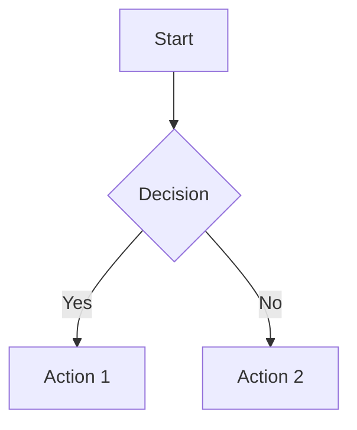

# Documentation Standards

## Overview

Good documentation is critical for large-scale ERP/SaaS projects. This document outlines documentation requirements, standards, and best practices.

## Documentation Types

### 1. README Files

Every project, module, and package needs a README.

```markdown
# Module Name

**Version:** 1.0.0  
**Status:** Active

## Overview

Brief description of what this module does and why it exists.

## Structure

```
module-name/
├── src/
├── tests/
└── README.md
```

## Installation

```bash
npm install module-name
```

## Usage

### Basic Example

```typescript
import { Module } from 'module-name';

const result = Module.process(data);
```

### Advanced Example

```typescript
import { Module } from 'module-name';

const module = new Module({
  config: 'value',
});

const result = await module.processAsync(data);
```

## API

### Functions

- `process(data: Data): Result` - Processes data
- `validate(data: Data): boolean` - Validates data

### Classes

- `Module` - Main class for processing

## Configuration

| Option | Type | Default | Description |
|--------|------|---------|-------------|
| debug | boolean | false | Enable debug mode |

## Testing

```bash
npm test
npm run test:coverage
```

## License

MIT
```

### 2. API Documentation

Document all public APIs.

```markdown
# API Documentation

## Endpoints

### GET /api/v1/users

Retrieve a list of users.

**Response:**
```json
{
  "data": [
    {
      "id": "uuid",
      "name": "string",
      "email": "string"
    }
  ],
  "pagination": {
    "page": 1,
    "limit": 10,
    "total": 100
  }
}
```

### POST /api/v1/users

Create a new user.

**Request Body:**
```json
{
  "name": "string (required)",
  "email": "string (required)",
  "password": "string (required)"
}
```

**Response:**
```json
{
  "id": "uuid",
  "name": "string",
  "email": "string"
}
```

## Authentication

All endpoints require authentication via Bearer token.

```
Authorization: Bearer <token>
```

## Rate Limiting

- 100 requests per minute per user
- 1000 requests per hour per user

## Error Responses

| Status | Code | Description |
|--------|------|-------------|
| 400 | INVALID_INPUT | Request validation failed |
| 401 | UNAUTHORIZED | Authentication required |
| 403 | FORBIDDEN | Insufficient permissions |
| 404 | NOT_FOUND | Resource not found |
| 500 | SERVER_ERROR | Internal server error |
```

### 3. Architecture Decision Records (ADRs)

Document architecture decisions.

```markdown
# ADR-001: Database Technology Selection

## Context

We need to choose a database for our ERP system. The system requires:
- ACID compliance
- Complex queries
- High availability
- Scalability

## Options Considered

### PostgreSQL

**Pros:**
- ACID compliant
- Rich query capabilities
- Strong community
- Good performance

**Cons:**
- Scaling requires more effort
- Learning curve for complex features

### MongoDB

**Pros:**
- Easy scaling
- Flexible schema
- Good for document-based data

**Cons:**
- No ACID compliance (until 4.0)
- Complex queries are harder
- Memory usage

### MySQL

**Pros:**
- Well-understood
- Good performance
- Strong community

**Cons:**
- Limited JSON support
- Scaling challenges

## Decision

**We chose PostgreSQL.**

### Rationale

- ACID compliance is critical for ERP
- Complex queries are common in ERP
- Performance is acceptable
- Community support is strong

### Implementation

- Use PostgreSQL 15
- Enable logical replication
- Set up read replicas
- Implement connection pooling

## Consequences

### Positive

- Data integrity guaranteed
- Complex queries supported
- Good performance for our use case

### Negative

- Scaling requires more effort
- Learning curve for team
- More complex setup

## Next Steps

- Set up production database
- Migrate existing data
- Document database schema
- Train team on PostgreSQL

## References

- [PostgreSQL Documentation](https://www.postgresql.org/docs/)
- [Database Selection Study](https://example.com/study)
```

### 4. Module Documentation

Document each business module.

```markdown
# Inventory Module

**Version:** 1.0.0  
**Domain:** Inventory Management  
**Bounded Context:** Warehouse Operations

## Overview

The Inventory module manages product inventory across warehouses. It handles:
- Stock levels
- Warehouse operations
- Reordering
- Inventory tracking

## Domain Model

### Entities

- `Product` - A product in inventory
- `Warehouse` - A physical warehouse
- `Stock` - Stock level for a product in a warehouse
- `Movement` - Inventory movement record

### Value Objects

- `ProductId` - Unique product identifier
- `WarehouseId` - Unique warehouse identifier
- `Quantity` - Stock quantity
- `Location` - Physical location in warehouse

## API

### Endpoints

- `GET /inventory/products` - List products
- `GET /inventory/stock/{productId}` - Get stock level
- `POST /inventory/movements` - Record movement
- `POST /inventory/reorder` - Trigger reorder

## Integration

### Dependencies

- `Products` module - Product information
- `Sales` module - Sales data for forecasting
- `Accounting` module - Inventory valuation

### Dependencies On

- None

## Testing

- Unit tests: `tests/unit/`
- Integration tests: `tests/integration/`

## Documentation

- `API.md` - API documentation
- `DECISIONS.md` - Architecture decisions
- `TESTING.md` - Testing strategy
```

## Documentation Standards

### Writing Style

- Use active voice
- Be concise
- Avoid jargon
- Use examples
- Include diagrams

### Formatting

```markdown
# Headers (PascalCase)
## Section Headers
### Subsections

- Bullet lists
- Numbered lists

```code blocks```

| Tables | Are | Good |
|--------|-----|------|
| Use    | them| for  |
| Data   | tables |   |

> Quotes for emphasis
```

### Diagram Requirements

Use Mermaid for diagrams:



## Documentation Locations

```
docs/
├── README.md                    # Main README
├── architecture/
│   ├── decisions/              # ADRs
│   │   ├── ADR-001.md
│   │   └── ADR-002.md
│   └── patterns/               # Architecture patterns
│       ├── layered-architecture.md
│       └── ddd.md
├── api/                        # API documentation
│   ├── v1/
│   │   ├── endpoints/
│   │   └── guides/
│   └── README.md
├── modules/                    # Module documentation
│   ├── inventory/
│   │   ├── README.md
│   │   ├── API.md
│   │   └── DECISIONS.md
│   └── sales/
│       └── ...
├── contributing.md             # Contributing guide
└── deployment.md               # Deployment guide
```

## Documentation Maintenance

### When to Update

- After any architectural decision
- When adding new APIs
- When changing behavior
- When fixing bugs that change behavior
- When onboarding new team members

### Documentation Review

- Review PRs include documentation changes
- Documentation is checked in code review
- Outdated documentation is flagged

## Documentation Tools

### Static Site Generators

| Tool | Purpose |
|------|---------|
| Docusaurus | React-based docs site |
| MkDocs | Python-based docs site |
| Sphinx | Python API docs |
| JSDoc | JavaScript API docs |

### API Documentation

| Tool | Purpose |
|------|---------|
| Swagger/OpenAPI | REST API docs |
| Postman | API testing & docs |
| GraphQL Schema | GraphQL docs |

## Anti-Patterns

### Outdated Documentation

```markdown
# ❌ BAD: Outdated example
```typescript
// This example is outdated
const result = oldFunction();
```

# ✅ GOOD: Updated example
```typescript
// Current example
const result = newFunction();
```
```

### No Examples

```markdown
# ❌ BAD: No examples
The function processes data.

# ✅ GOOD: With examples
The function processes data:

```typescript
const result = processor.process(data);
```
```

### Too Much Detail

```markdown
# ❌ BAD: Too much detail
1. Open the file
2. Read the content
3. Parse the JSON
4. Validate the schema
5. ...

# ✅ GOOD: Appropriate detail
The function reads and parses a JSON file.
```

## References

- [Google Developer Documentation Style Guide](https://developers.google.com/style)
- [Microsoft Writing Style Guide](https://docs.microsoft.com/en-us/style-guide/)
- [Docusaurus Documentation](https://docusaurus.io/)
