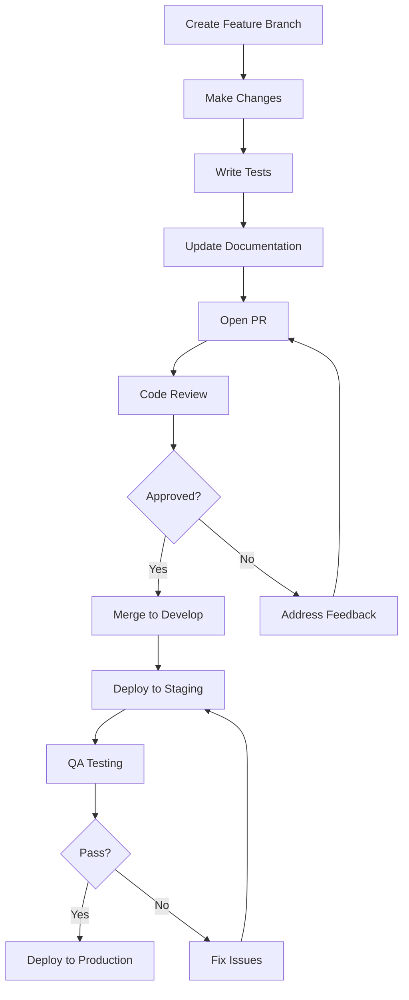

# Team Collaboration Workflows

## Overview

Effective collaboration is critical for large-scale ERP/SaaS projects. This document outlines workflows, practices, and guidelines for team collaboration.

## Team Structure

### Organizational Structure

```
┌─────────────────────────────────────────────────────────────┐
│                    Product Team                             │
├─────────────────────────────────────────────────────────────┤
│  Product Owner                                              │
│  └── Requirements, Prioritization, ROI                     │
│                                                             │
│  Technical Lead                                             │
│  └── Architecture, Code Quality, Technical Decisions       │
│                                                             │
│  Frontend Team     Backend Team     DevOps Team            │
│  └── UI/UX         └── APIs         └── Infrastructure     │
│      Components    └── Services     └── CI/CD              │
│      & Layout      └── Databases    └── Monitoring         │
└─────────────────────────────────────────────────────────────┘
```

### Team Size Guidelines

| Team Size | Structure | Communication |
|-----------|-----------|---------------|
| 1-3 developers | Generalists | Informal, daily sync |
| 4-8 developers | Feature teams | Weekly planning, daily standup |
| 9-15 developers | Component teams | Bi-weekly planning, daily standup |
| 15+ developers | Domain teams | Monthly planning, daily standup |

## Development Workflow

### Git Flow

```
main (production)
│
├── develop (staging)
│   │
│   ├── feature/login
│   ├── feature/dashboard
│   └── feature/reports
│
├── release/1.0.0
│   ├── hotfix/login-bug
│   └── hotfix/payment-issue
```

### Branch Naming Conventions

| Branch Type | Pattern | Example |
|-------------|---------|---------|
| Feature | `feature/description` | `feature/user-auth` |
| Bugfix | `bugfix/description` | `bugfix/login-error` |
| Hotfix | `hotfix/description` | `hotfix/payment-crash` |
| Release | `release/version` | `release/1.0.0` |
| Document | `docs/description` | `docs/api-reference` |

### Pull Request Process



### PR Checklist

```markdown
## PR Checklist

- [ ] Branch is up-to-date with target
- [ ] Changes are atomic and focused
- [ ] Tests are added/updated
- [ ] Documentation is updated
- [ ] Code follows project conventions
- [ ] No sensitive data in code
- [ ] Performance impact considered
- [ ] Security implications reviewed
```

## Code Review Process

### Review Guidelines

1. **Focus on Code, Not Person**
   - "This could be simplified" vs "You made this too complex"

2. **Be Specific**
   - "Use camelCase for variables" vs "Naming is wrong"

3. **Explain Why**
   - Explain the reasoning behind suggestions

4. **Be Timely**
   - Review within 24 hours

### Review Types

| Type | When | Duration |
|------|------|----------|
| Quick | Small changes | < 15 minutes |
| Standard | Medium changes | < 1 hour |
| Deep | Large/complex | < 2 hours |
| Security | Security changes | < 4 hours |

### Review Checklist

```markdown
## Code Review Checklist

### Functionality
- [ ] Does it work as expected?
- [ ] Are edge cases handled?
- [ ] Are errors handled properly?

### Code Quality
- [ ] Follows project conventions?
- [ ] Is it readable and maintainable?
- [ ] Are comments helpful?

### Performance
- [ ] No obvious performance issues?
- [ ] Efficient algorithms?
- [ ] Memory usage considered?

### Security
- [ ] No sensitive data exposure?
- [ ] Input validation?
- [ ] Authentication/authorization?

### Testing
- [ ] Tests added/updated?
- [ ] Test coverage sufficient?
- [ ] Edge cases covered?
```

## Communication Practices

### Daily Standup

**Format (15 minutes max):**
1. What did you do yesterday?
2. What will you do today?
3. Any blockers?

**Rules:**
- Be concise
- Focus on progress
- Note blockers immediately

### Weekly Planning

**Agenda (60 minutes):**
1. Review completed work
2. Plan upcoming sprint
3. Assign tasks
4. Identify risks

### Monthly Retrospective

**Focus Areas:**
1. What went well?
2. What could improve?
3. Action items

## Knowledge Sharing

### Documentation Requirements

```markdown
## Documentation Checklist

- [ ] README.md updated
- [ ] API documentation updated
- [ ] Architecture Decision Records added
- [ ] Code comments added where needed
- [ ] Examples provided
```

### Code Walkthroughs

**When to Conduct:**
- Large feature implementation
- Complex refactoring
- New team members onboarding

**Format:**
1. Presenter explains the code
2. Team asks questions
3. Discuss alternatives
4. Document decisions

## Onboarding New Developers

### Week 1 Checklist

**Day 1:**
- [ ] Set up development environment
- [ ] Run project locally
- [ ] Understand project structure
- [ ] Meet team members

**Day 2-3:**
- [ ] Read architecture documentation
- [ ] Review codebase structure
- [ ] Run tests
- [ ] Understand CI/CD pipeline

**Day 4-5:**
- [ ] Complete onboarding task
- [ ] Review pull requests
- [ ] Attend team meetings
- [ ] Understand development workflow

### First Task Guidelines

- Start with small, well-defined tasks
- Choose issues labeled "good first issue"
- Pair with experienced developer
- Review documentation first

## Conflict Resolution

### Technical Disagreements

1. **Data-Driven Decision**
   - Compare performance metrics
   - Review documentation
   - Test both approaches

2. **Escalation Path**
   - Team discussion (24 hours)
   - Technical lead decision (if needed)
   - Architecture review board (complex cases)

### Communication Issues

1. **Direct Conversation**
   - Discuss privately first
   - Focus on behavior, not person

2. **Mediation**
   - Involve team lead if needed
   - Focus on solutions

## Remote Work Best Practices

### Async Communication

- Use written communication for complex topics
- Document decisions
- Use status updates
- Respect time zones

### Synchronous Meetings

- Use video when possible
- Share screens for code reviews
- Record important meetings
- Share meeting notes

## Tools and Resources

### Essential Tools

| Purpose | Tool |
|---------|------|
| Version Control | Git, GitHub/GitLab |
| Communication | Slack, Microsoft Teams |
| Documentation | Confluence, Notion |
| Project Management | Jira, Linear |
| Code Review | GitHub PR, GitLab MR |

### Productivity Tools

| Purpose | Tool |
|---------|------|
| Terminal | VS Code, iTerm2, Windows Terminal |
| Database | TablePlus, DBeaver |
| API Testing | Postman, Insomnia |
| Monitoring | Datadog, New Relic |

## Anti-Patterns

### Too Many Meetings

```
❌ BAD: 80% of day in meetings
✅ GOOD: 20% of day in meetings, 80% in focused work
```

### No Documentation

```
❌ BAD: Knowledge only in people's heads
✅ GOOD: All decisions documented in ADRs
```

### Blame Culture

```
❌ BAD: "Who broke it?"
✅ GOOD: "How do we prevent it?"
```

### Siloed Teams

```
❌ BAD: Frontend and backend work separately
✅ GOOD: Cross-functional teams
```

## References

- [Team Topologies](https://teamtopologies.com/) - Matthew Skelton
- [The DevOps Handbook](https://itrevolution.com/book/the-devops-handbook/) - Gene Kim
- [Accelerate](https://itrevolution.com/book/accelerate/) - Nicole Forsgren
